# ✅ MateCode

## 📌 Índice

- [Descripción](#-descripción)
- [Demo En Vivo](#-demo-en-vivo)
- [Funcionalidades](#-funcionalidades)
- [Requisitos Para Desplegar En Vercel](#-requisitos-para-desplegar-en-vercel)
- [Prueba Local](#-prueba-local)
- [Variables De Entorno](#-variables-de-entorno)
- [Tecnologías Usadas](#-tecnologías-usadas)
- [Organización Del Proyecto](#-organización-del-proyecto)
- [Arquitectura Y Decisiones Técnicas](#-arquitectura-y-decisiones-técnicas)
- [Capturas De La App Celular](#-capturas-de-la-app-celular)
- [Capturas De La App Computadora](#-capturas-de-la-app-computadora)
- [Uso De La IA](#-uso-de-la-ia)
- [Tests](#-tests)
- [Notas](#-notas)
- [Autor](#-autor)

## ✨ Descripción

MateCode es una aplicación web de gestión de tareas desarrollada como SPA con React, TypeScript y Vite.

La app permite que cada usuario pueda registrarse, iniciar sesión, administrar sus propias tareas y enviar por email un resumen de su progreso. Las tareas se guardan en Firebase Firestore y se filtran por el usuario autenticado, para que cada cuenta vea únicamente su propia información.

El proyecto también incluye una integración serverless con Vercel Functions y AWS SES para el envío de emails, además de tests automatizados con Vitest y React Testing Library.

## 🚀 Demo En Vivo

Podés ver la app desplegada en:

[https://proyecto-m4-matias-gaitan.vercel.app/](https://proyecto-m4-matias-gaitan.vercel.app/)

## 🧩 Funcionalidades

- Registro de usuarios con email y contraseña.
- Inicio de sesión con email y contraseña.
- Inicio de sesión con Google.
- Cierre de sesión.
- Protección de rutas privadas con React Router.
- Creación de tareas asociadas al usuario autenticado.
- Listado de tareas filtradas por `userId`.
- Edición de título, descripción y estado de la tarea.
- Eliminación de tareas.
- Estados visuales de carga, éxito y error.
- Envío de resumen de tareas por email mediante una función serverless.
- Persistencia de datos en Firebase Firestore.
- Validaciones de formularios.
- Tests unitarios y de componentes.
- Diseño responsive mobile first.

## ▲ Requisitos Para Desplegar En Vercel

Para desplegar el proyecto en Vercel se necesita:

- Una cuenta en Vercel.
- Node.js en una versión LTS recomendada, por ejemplo Node 20.
- Tener instalada la Vercel CLI si se desea desplegar desde terminal.
- Un proyecto creado en Firebase.
- Authentication habilitado en Firebase.
- Firestore Database habilitado en Firebase.
- AWS SES configurado para el envío de emails.
- Variables de entorno configuradas en Vercel.

Pasos para desplegar desde la terminal:

1. Instalar Vercel CLI:

```bash
npm install -g vercel
```

2. Iniciar sesión en Vercel:

```bash
vercel login
```

3. Vincular el proyecto local con Vercel:

```bash
vercel link
```

4. Agregar las variables de entorno necesarias:

```bash
vercel env add VITE_FIREBASE_API_KEY
vercel env add VITE_FIREBASE_AUTH_DOMAIN
vercel env add VITE_FIREBASE_PROJECT_ID
vercel env add VITE_FIREBASE_STORAGE_BUCKET
vercel env add VITE_FIREBASE_MESSAGING_SENDER_ID
vercel env add VITE_FIREBASE_APP_ID

vercel env add AWS_REGION
vercel env add AWS_ACCESS_KEY_ID
vercel env add AWS_SECRET_ACCESS_KEY

vercel env add SES_FROM_EMAIL
vercel env add SES_TO_EMAIL
```

5. Ejecutar un deploy de prueba:

```bash
vercel
```

6. Ejecutar el deploy final a producción:

```bash
vercel --prod
```

7. Verificar que la URL generada cargue la SPA y que funcione:

```txt
/api/send-email
```

También es necesario agregar el dominio del deploy en Firebase:

```txt
Firebase Console > Authentication > Settings > Authorized domains
```

## 🛠️ Prueba Local

Para probar el proyecto localmente:

1. Clonar el repositorio:

```bash
git clone https://github.com/MatiasAGaitan/ProyectoM4_MatiasGaitan.git
```

2. Entrar a la carpeta del proyecto:

```bash
cd proyecto-final
```

3. Instalar dependencias:

```bash
npm install
```

4. Crear un archivo `.env` en la raíz del proyecto con las variables necesarias.

5. Levantar el entorno local de Vite:

```bash
npm run dev
```

6. Abrir la app en el navegador:

```txt
http://localhost:5173
```

Para probar también la función serverless localmente:

```bash
npm run dev:vercel
```

## 🔐 Variables De Entorno

El proyecto necesita variables para Firebase y para AWS SES.

Ejemplo de `.env` local:

```env
VITE_FIREBASE_API_KEY=
VITE_FIREBASE_AUTH_DOMAIN=
VITE_FIREBASE_PROJECT_ID=
VITE_FIREBASE_STORAGE_BUCKET=
VITE_FIREBASE_MESSAGING_SENDER_ID=
VITE_FIREBASE_APP_ID=

AWS_REGION=
AWS_ACCESS_KEY_ID=
AWS_SECRET_ACCESS_KEY=
SES_FROM_EMAIL=
SES_TO_EMAIL=
```

Las variables que comienzan con `VITE_` son utilizadas por el frontend para inicializar Firebase.

Las variables `AWS_REGION`, `AWS_ACCESS_KEY_ID`, `AWS_SECRET_ACCESS_KEY`, `SES_FROM_EMAIL` y `SES_TO_EMAIL` se utilizan únicamente en la función serverless `api/send-email.ts`.

`AWS_ACCESS_KEY_ID` y `AWS_SECRET_ACCESS_KEY` son leídas automáticamente por el SDK de AWS al crear el cliente de SES.

`SES_FROM_EMAIL` y `SES_TO_EMAIL` son utilizadas por la función serverless para enviar correos electrónicos.

Enviamos correo a ambos destinatarios para que quede registrado en mi correo como tambien en el del usuario ambos correos tienen que estar verificados en AWS SES.

No se deben subir claves privadas ni archivos `.env` al repositorio.

## ⚙️ Tecnologías Usadas

- ⚛️ React
- 🔷 TypeScript
- ⚡ Vite
- 🧭 React Router DOM
- 🔥 Firebase Authentication
- 🗄️ Firebase Firestore
- ▲ Vercel Serverless Functions
- ✉️ AWS SES
- 🧪 Vitest
- 🧪 React Testing Library
- 🎨 CSS3
- 🌿 Git y GitHub
- 🚀 Vercel

## 🗂️ Organización Del Proyecto

```txt
📦 MateCode
├── 📁 api
│   ├── 📄 send-email.ts
├── 📁 public
│   ├── 📄 favicon.svg
│   └── 📄 icons.svg
├── 📁 src
│   ├── 📁 assets
│   │   ├── 📁 Celular
│   │   │   ├── 📄 about1.png
│   │   │   ├── 📄 about2.png
│   │   │   ├── 📄 editing.png
│   │   │   ├── 📄 home1.png
│   │   │   ├── 📄 home2.png
│   │   │   ├── 📄 login.png
│   │   │   ├── 📄 register.png
│   │   │   └── 📄 tasks.png
│   │   ├── 📁 Computadora
│   │   │   ├── 📄 about.png
│   │   │   ├── 📄 editing.png
│   │   │   ├── 📄 home.png
│   │   │   ├── 📄 login.png
│   │   │   ├── 📄 register.png
│   │   │   └── 📄 tasks.png
│   │   ├── 📄 about-portatil.png
│   │   ├── 📄 favicon.png
│   │   ├── 📄 firebase.svg
│   │   ├── 📄 github.svg
│   │   ├── 📄 home-celular.png
│   │   ├── 📄 react.svg
│   │   ├── 📄 ts.svg
│   │   └── 📄 vite.svg
│   ├── 📁 components
│   │   ├── 📄 LoginForm.tsx
│   │   ├── 📄 RegisterForm.tsx
│   │   ├── 📄 RenderStatus.tsx
│   │   ├── 📄 RequireAuth.tsx
│   │   ├── 📄 SendEmailButton.tsx
│   │   ├── 📄 TaskEdit.tsx
│   │   ├── 📄 TaskForm.tsx
│   │   └── 📄 TaskList.tsx
│   ├── 📁 config
│   │   └── 📄 firebase.config.ts
│   ├── 📁 features
│   │   ├── 📄 authErrors.ts
│   │   └── 📄 Authenticator.tsx
│   ├── 📁 layouts
│   │   └── 📄 Layout.tsx
│   ├── 📁 pages
│   │   ├── 📄 About.tsx
│   │   ├── 📄 Home.tsx
│   │   ├── 📄 Login.tsx
│   │   ├── 📄 Register.tsx
│   │   └── 📄 Tasks.tsx
│   ├── 📁 routes
│   │   └── 📄 AppRoutes.tsx
│   ├── 📁 services
│   │   └── 📄 firestore.ts
│   ├── 📁 types
│   │   ├── 📄 auth.ts
│   │   ├── 📄 buttonEmail.ts
│   │   ├── 📄 status.ts
│   │   └── 📄 task.ts
│   ├── 📁 utils
│   │   ├── 📄 authValidation.ts
│   │   ├── 📄 createTaskSummary.ts
│   │   └── 📄 inputValidate.ts
│   ├── 📄 App.css
│   ├── 📄 App.tsx
│   ├── 📄 index.css
│   ├── 📄 main.tsx
│   └── 📄 setupTests.ts
├── 📄 index.html
├── 📄 package.json
├── 📄 README.md
├── 📁 test
│   └── 📁 api
│       └── 📄 send-email.test.ts
├── 📄 tsconfig.json
└── 📄 vite.config.ts
```

Los tests se encuentran junto a los archivos que validan, por ejemplo:

```txt
src/components/TaskForm.test.tsx
src/components/TaskList.test.tsx
src/components/SendEmailButton.test.tsx
src/utils/inputValidate.test.ts
```

## 🧱 Arquitectura Y Decisiones Técnicas

El proyecto está organizado por responsabilidades:

- `components`: componentes reutilizables y partes principales de la UI.
- `pages`: pantallas principales de la SPA.
- `features`: lógica relacionada con autenticación.
- `services`: comunicación con servicios externos, como Firestore.
- `types`: tipos reutilizables de TypeScript.
- `utils`: funciones puras de validación y transformación de datos.
- `api`: función serverless para enviar emails con AWS SES.

### 🔐 Autenticación

La autenticación está centralizada en `Authenticator.tsx`, que expone el usuario actual, el estado de carga y funciones como registro, login, login con Google y logout.

La ruta `/tasks` está protegida con `RequireAuth`, evitando que usuarios no autenticados accedan al panel de tareas.

### 🗄️ Firestore

Las tareas se guardan en la colección `tasks` de Firestore. Cada tarea contiene un `userId`, lo que permite filtrar los datos por usuario autenticado.

El servicio `firestore.ts` contiene las operaciones principales:

- `getTasksByUser`
- `addTask`
- `editTask`
- `deleteTask`

La UI se actualiza después de cada operación para reflejar los cambios sin recargar la página.

### ✉️ Serverless Y Email

El envío de emails se realiza desde `api/send-email.ts`, una función serverless de Vercel.

El frontend no expone credenciales de AWS. La función recibe el payload, valida los datos y utiliza AWS SES del lado del servidor.

La función valida:

- Método HTTP permitido.
- Formato del body.
- Nombre.
- Email.
- Longitud del mensaje.
- Variables de entorno requeridas.

### 🎨 Diseño

La interfaz fue trabajada con enfoque mobile first, manteniendo una estética oscura con detalles dorados. El layout se adapta entre mobile y desktop usando CSS responsive.

## 🖼️ Capturas De La App Celular

### 🏠 Home

| Home 1 | Home 2 |
| --- | --- |
| 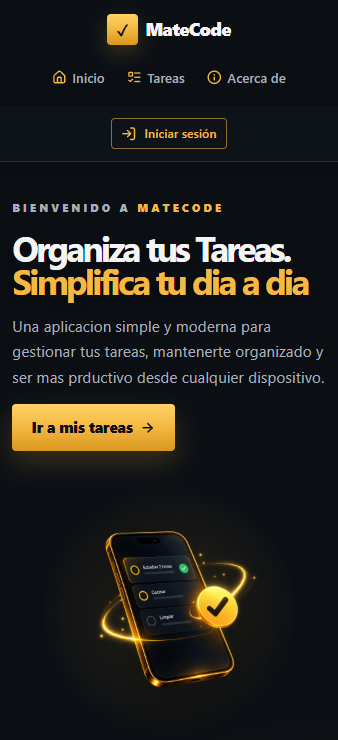 | 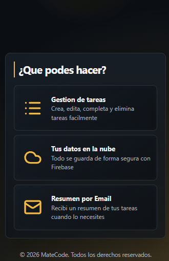 |

### ✅ Tareas

| Tareas |
| --- |
| 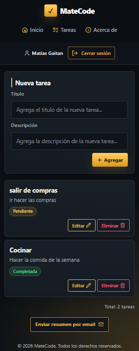 |

### ✏️ Editando Tareas

| Editando tarea |
| --- |
| 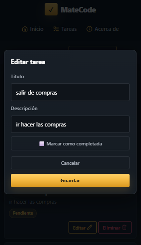 |

### ℹ️ About

| About 1 | About 2 |
| --- | --- |
| 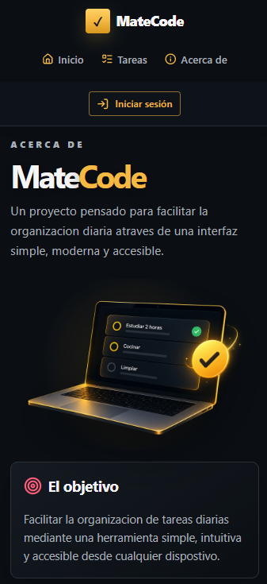 | 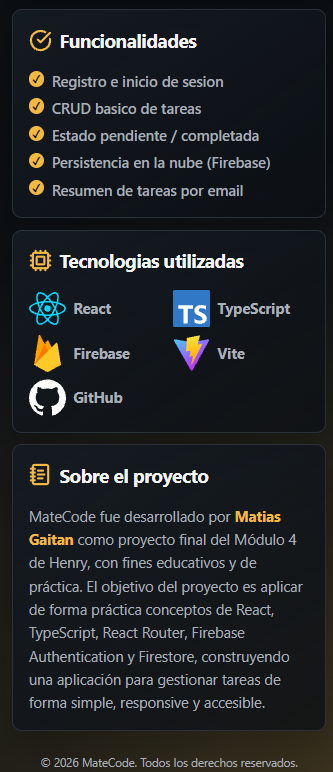 |

### 📞 Login

| Login |
| --- |
| 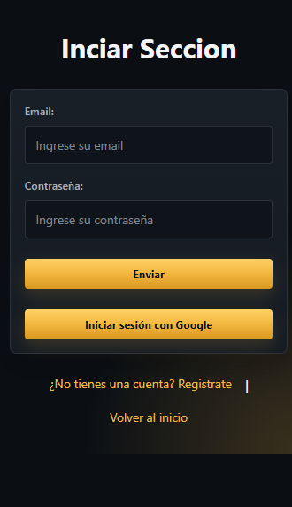 |

### 🔗 Register

| Register |
| --- |
| 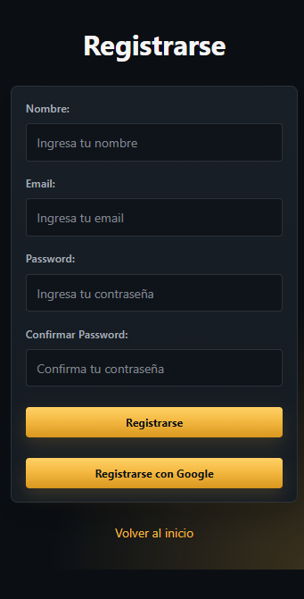 |

## 🖼️ Capturas De La App Computadora

### 🏠 Home Desktop

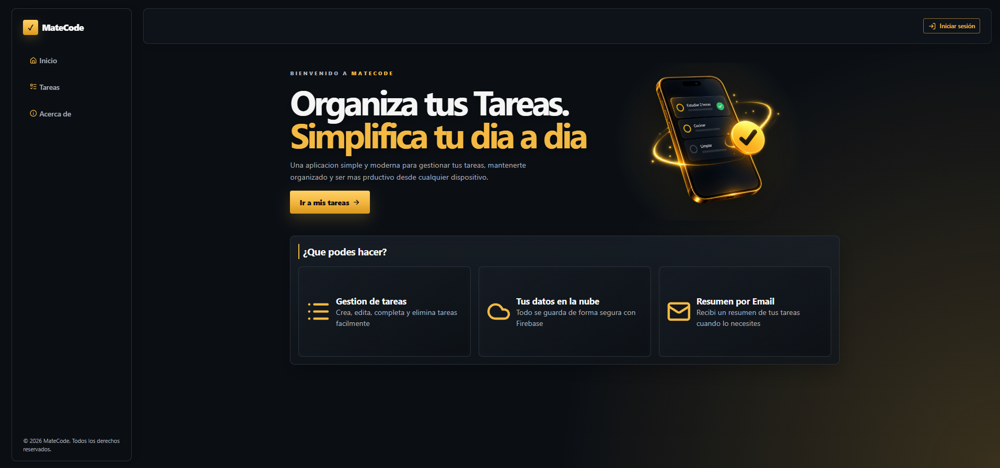

### ✅ Tareas Desktop

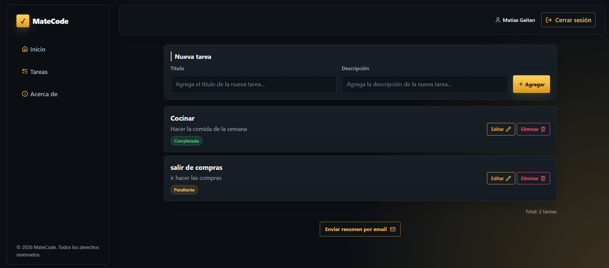

### ✏️ Editando Tareas

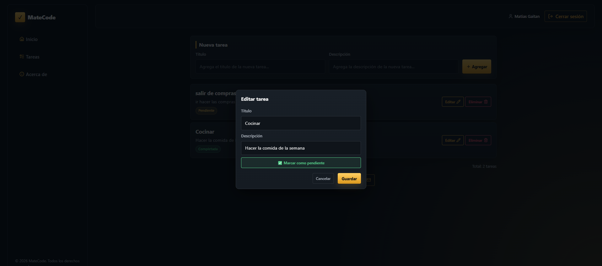

### ℹ️ About

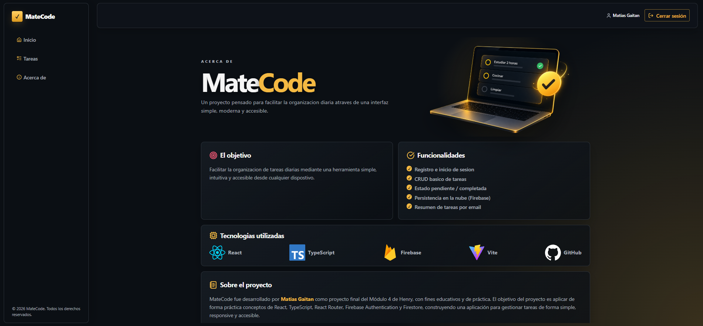

### 📞 Login


### 🔗 Register


## 🤖 Uso De La IA

Durante el desarrollo se utilizó IA como apoyo para revisar código, comparar alternativas y validar decisiones técnicas.

El uso principal de IA fue:

- Pedir explicaciones paso a paso sobre errores de TypeScript.
- Comparar enfoques antes de modificar componentes.
- Revisar la separación entre UI, servicios, tipos y utilidades.
- Pedir ejemplos mínimos de tests con Vitest y React Testing Library.
- Analizar mensajes de error y entender su causa antes de corregirlos.
- Revisar el proyecto contra la rúbrica para detectar mejoras pendientes.

Las decisiones finales se aplicaron entendiendo el código y manteniendo cambios pequeños. Por ejemplo, se priorizó mockear servicios externos en tests en lugar de llamar Firebase o AWS reales, y se mantuvo la validación serverless para no exponer credenciales en el frontend.

Evidencia del uso de IA:

[Documentación de uso de IA](https://docs.google.com/document/d/1BlPkXbY3kvQmgDBuLallqTIzDhIYZ3jIizPOPHQP_V4/edit?usp=sharing)

## 🧪 Tests

El proyecto incluye tests automatizados con Vitest y React Testing Library.

Actualmente se testean:

- Validación de tareas.
- Validación de login y registro.
- Generación del resumen de tareas.
- Renderizado de estados visuales.
- Formulario de creación de tareas.
- Listado de tareas.
- Modal de edición de tareas.
- Botón de envío de email.
- Página de tareas con mock de Firestore y Auth.
- Función serverless de email con mock de AWS SES.

### Ejecutar Todos Los Tests

Para ejecutar los tests una sola vez:

```bash
npm test -- --run
```

### Ejecutar Tests En Modo Watch

```bash
npm run test:watch
```


## 📝 Notas

- El archivo `.env` no debe subirse al repositorio.
- Las credenciales de Firebase utilizadas por Vite deben comenzar con `VITE_`.
- Las credenciales de AWS SES se usan solo del lado serverless.
- La función serverless principal se encuentra en `api/send-email.ts`.
- Las rutas privadas se protegen con `RequireAuth`.
- Las tareas se filtran por `userId`.
- El proyecto usa commits semánticos para mantener historial claro.
- En Firebase Authentication se debe agregar el dominio de Vercel en `Authorized domains`.

### 🔒 Reglas De Firestore

Se recomienda configurar reglas para que cada usuario solo pueda leer y modificar sus propias tareas.

Ejemplo orientativo:

```txt
rules_version = '2';

service cloud.firestore {
  match /databases/{database}/documents {
    match /tasks/{taskId} {
      allow read: if request.auth != null
        && request.auth.uid == resource.data.userId;

      allow create: if request.auth != null
        && request.auth.uid == request.resource.data.userId;

      allow update, delete: if request.auth != null
        && request.auth.uid == resource.data.userId;
    }
  }
}
```

### ✉️ Flujo De Envío De Email

El envío del resumen de tareas se realiza mediante una función serverless para evitar exponer credenciales sensibles en el frontend.

El flujo funciona de la siguiente manera:

1. El usuario inicia sesión y entra a la sección de tareas.

2. Desde el botón **Enviar resumen por email**, el componente `SendEmailButton` toma las tareas actuales del usuario.

3. Las tareas se transforman en un texto resumido mediante la función `createTaskSummary(tasks)`.

4. El frontend envía una petición `POST` a la función serverless:

```txt
/api/send-email
```

5. La función `api/send-email.ts` valida que el cuerpo de la petición tenga los datos necesarios:

- `name`
- `email`
- `message`

6. También valida que existan las variables de entorno necesarias para AWS SES:

- `AWS_REGION`
- `AWS_ACCESS_KEY_ID`
- `AWS_SECRET_ACCESS_KEY`
- `SES_FROM_EMAIL`
- `SES_TO_EMAIL`

7. Si los datos son válidos, la función crea un cliente de AWS SES y prepara el comando de envío con `SendEmailCommand`.

8. El correo se envía a dos destinatarios:

- El email del usuario autenticado.
- El email configurado en `SES_TO_EMAIL`.

Esto permite que el usuario reciba su resumen y que también quede una copia registrada en el correo del administrador.

9. Finalmente, la interfaz muestra el resultado del envío:

- ✅ `Email enviado correctamente`
- ❌ Mensaje de error si algo falla

Este flujo mantiene las credenciales protegidas, porque el frontend nunca accede directamente a AWS SES. Toda la comunicación sensible ocurre dentro de la función serverless de Vercel.


## 👨‍💻 Autor

Proyecto desarrollado por **Matías Gaitán**.

- GitHub: [MatiasAGaitan](https://github.com/MatiasAGaitan)
- Deploy: [https://proyecto-m4-matias-gaitan.vercel.app/](https://proyecto-m4-matias-gaitan.vercel.app/)
